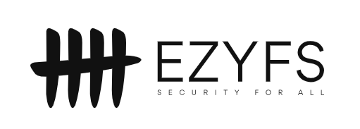
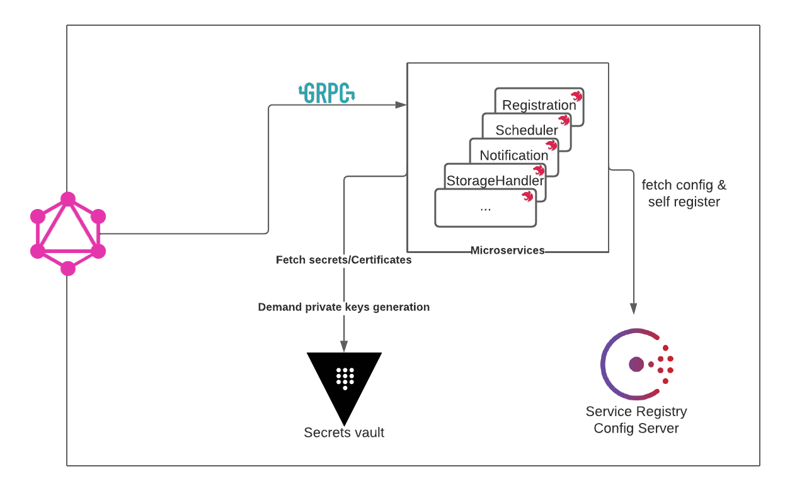
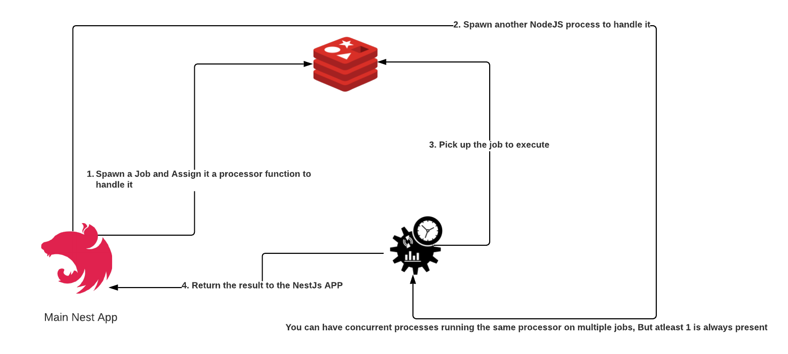

EzyFS( Easy File System ) is an application that facilitates File system
operations, making them accessible to non technical users.

## Technologies

  
  
   
   
   
   
   
   

## Architecture

## How we optimized our heavy workload microservice

Compression And encryption come in really handy, but they also consume alot of
computation power when used on large files. This may lead to performance issues
in NodeJs APPs. NodeJs is a single threaded engine. So to make use of multiple
CPUs cores, EzyFS introduced Parallel Processors.

### How it works:

## Supported Processors

- Compression/Decompression: `.tgz`
- Encryption/Decryption: Will have support for `rsa`, `ECC`.
  > Our encryption engine will have compression by default.

## Hybrid Encryption System

EzyFS implements a high security hybrid encryption system. Either `RSA-AES` or
`ECC-AES`, depending on the user's choice! Here are the steps:

1. A random Cihper key is generated then used to encrypt. It is then encrypted
   with the owner's ECC/RSA key and stored in our DB. Every job will have its
   own cipher key for obvious security reasons.
2. A random initialazation vector is generated and streamed to the file.
3. The file is then encrypted with AES256.
4. To decrypt, the owner must provide his private key to decrypt the cipherkey
   first. Then it's used to decrypt the file.

## Key Recovery (WiP)

EzyFS will offer you the option to use our Key Recovery System. From a security
point of view it comes with risks. But its benefits have a real merit too. If
you wish to read more about it. Click on this
[link](https://www.giac.org/paper/gsec/4355/encryption-key-recovery/107336). The
policies to achieve this can be reduced to these main points:

1. Keying material that should be recoverable by application
2. How and where the keying material will be saved
3. Who is responsible for the keying material, this could be an individual, a
   department, or even a trusted vendor
4. Who can request the recovery of a key
5. What decisive factors will allow or disallow a key recovery
6. Who owns the final decision if the decisive factors are not met
7. Audit procedure for the recovery process
8. Proper handling and destruction of recovered keying material
9. Identification of anyone that should be notified of recovered keying
   material.
10. Procedures to follow if the Key Recovery System has been compromised

## What EzyFS offers to you!

EzyFS will offer an easy to use interface to schedule Encryption/Compression
jobs. But also, needless to say, the ability to Decrypt/Decompress!

- A GraphQL API to interact with the Backend services.
- You can schedule periodic jobs (you can define them with CRON strings).
- You can update/pause/delete/restart your ongoing jobs.
- You can secure ur backups and sensitive files with EzyFS Asymmetic encryption.
  You'll be granted your private Key, and the job you launch, delete or do will
  have your fingerprint on them.
- History of all the actions you take that impact jobs.
- ...

## Feature roadmap

- Key Restoration after it has been corrupt
- Key Revokation
- Reassign a User key to another after that user leaves the company
- Ability to only respond to a certain Pool of IP Adresses ( Preferrably from
  VPNs )
