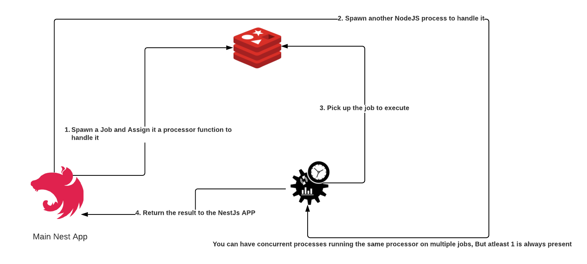

# EzyFS
EzyFS( Easy File System ) is an application that facilitates File system operations, making them accessible to non technical users.

## Multi-threadded? YES!
Compression And encryption come in really handy, but they also consume alot of computation power when used on large files. This may lead to performance issues in NodeJs APPs. NodeJs is a single threaded engine. So to make use of multiple CPUs cores, EzyFS introduced Parallel Processors.

### How it works:

## Supported Processors

* Compression/Decompression: `.tgz`
* Encryption/Decryption: Coming soon (Will support multiple encoding types and ciphers).

## What EzyFS offers to you!
EzyFS will offer an easy to use interface to schedule Encryption/Compression jobs. But also, needless to say, the ability to Decrypt/Decompress!
* A GraphQL API to interact with the Backend services. 
* You can schedule periodic jobs (you can define them with CRON strings).
* You can update/pause/delete/restart your ongoing jobs.
* You can secure ur backups and sensitive files with EzyFS Asymmetic encryption. You'll be granted your private Key, and the job you launch, delete or do will have your fingerprint on them.
* History of all the actions you take that impact jobs.
* ...